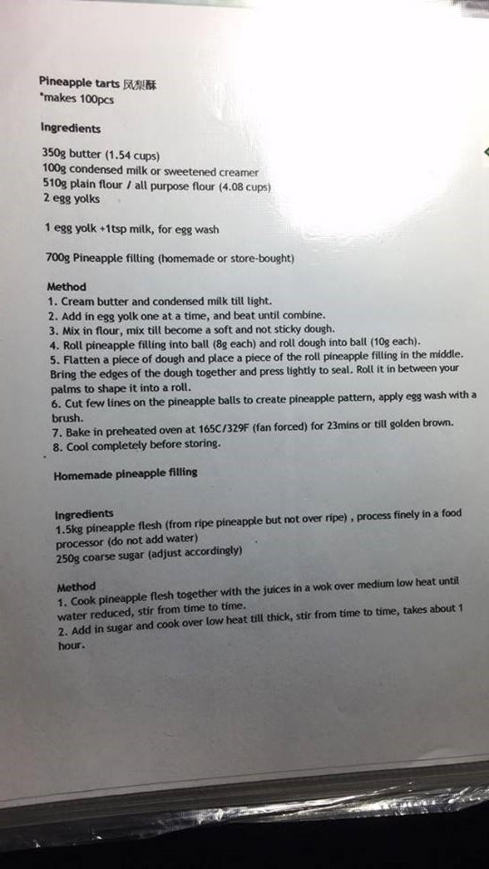

Pineapple Tart
============================

Makes ~100 pieces of small tarts

### Ingredients:

* 350g butter
* 100g condensed milk
* 510 g plain flour
* 2 egg yolks
* 2 ripe pineapples, cut into small pieces
* 1 egg + 1tsp milk for egg wash (only Malay version)

### Directions:

Puree pineapples. Cook down into a paste until all moisture has evaporated. Set aside to cool.

Cream butter and condensed milk till light.

Add in egg yolk one at a time, and beat until combined.

Mix in flour until mixture becomes a soft and not sticky dough.

#### Malay/Singaporean:

Pineapple: 8g balls.

Dough: 10g balls.

After wrapping the tarts, Cut a few lines on the tarts to create a pineapple pattern. Apply egg wash.

Bake for 23 minutes or until golden brown at 165°C/330°F.

Cool completely before storing.

#### Taiwanese:

Pineapple: 20g balls.

Dough: 30g balls.

Form into square shapes. Optionally, place into square molds.

Bake for 10 minutes at 165°C/330°F. Remove from oven and flip over all the tarts. Bake for another 10 minutes.